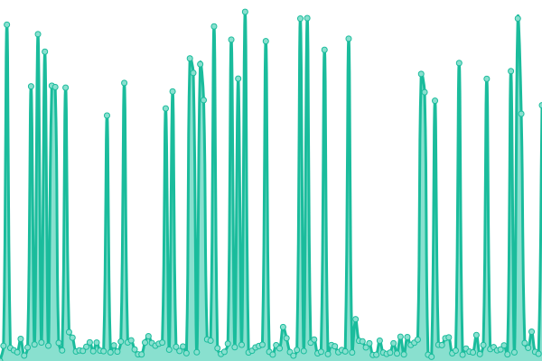

# [📈 Live Status](https://status.carletoncomputerscience.ca): <!--live status--> **🟧 Partial outage**

This repository contains the open-source uptime monitor and status page for [Carleton Computer Science Society](ccss.carleton.ca), powered by [Upptime](https://github.com/upptime/upptime).

With [Upptime](https://upptime.js.org), you can get your own unlimited and free uptime monitor and status page, powered entirely by a GitHub repository. We use [Issues](https://github.com/carletoncomputersciencesociety/status.carletoncomputerscience.ca/issues) as incident reports, [Actions](https://github.com/carletoncomputersciencesociety/status.carletoncomputerscience.ca/actions) as uptime monitors, and [Pages](https://status.carletoncomputerscience.ca) for the status page.

<!--start: status pages-->
<!-- This summary is generated by Upptime (https://github.com/upptime/upptime) -->
<!-- Do not edit this manually, your changes will be overwritten -->
<!-- prettier-ignore -->
| URL | Status | History | Response Time | Uptime |
| --- | ------ | ------- | ------------- | ------ |
|  [CCSS Website](https://ccss.carleton.ca) | 🟩 Up | [ccss-website.yml](https://github.com/CarletonComputerScienceSociety/status.carletoncomputerscience.ca/commits/HEAD/history/ccss-website.yml) | 

 157ms
     
 | 

<a href="https://status.carletoncomputerscience.ca/history/ccss-website">100.00%</a>
    

|  [SCS Website](https://scs.carleton.ca) | 🟩 Up | [scs-website.yml](https://github.com/CarletonComputerScienceSociety/status.carletoncomputerscience.ca/commits/HEAD/history/scs-website.yml) | 

 1059ms
     
 | 

<a href="https://status.carletoncomputerscience.ca/history/scs-website">100.00%</a>
    

|  [Course Website](https://courses.carletoncomputerscience.ca) | 🟩 Up | [course-website.yml](https://github.com/CarletonComputerScienceSociety/status.carletoncomputerscience.ca/commits/HEAD/history/course-website.yml) | 

 341ms
     
 | 

<a href="https://status.carletoncomputerscience.ca/history/course-website">100.00%</a>
    

|  [DiscreteMath.ca](https://discretemath.ca) | 🟩 Up | [discrete-math-ca.yml](https://github.com/CarletonComputerScienceSociety/status.carletoncomputerscience.ca/commits/HEAD/history/discrete-math-ca.yml) | 

 226ms
     
 | 

<a href="https://status.carletoncomputerscience.ca/history/discrete-math-ca">100.00%</a>
    

|  [DiscreteMath.ca API](https://api.discretemath.ca/graphql) | 🟩 Up | [discrete-math-ca-api.yml](https://github.com/CarletonComputerScienceSociety/status.carletoncomputerscience.ca/commits/HEAD/history/discrete-math-ca-api.yml) | 

 282ms
     
 | 

<a href="https://status.carletoncomputerscience.ca/history/discrete-math-ca-api">100.00%</a>
    

|  [Merged](https://merged.carletoncomputerscience.ca) | 🟥 Down | [merged.yml](https://github.com/CarletonComputerScienceSociety/status.carletoncomputerscience.ca/commits/HEAD/history/merged.yml) | 

 0ms
     
 | 

<a href="https://status.carletoncomputerscience.ca/history/merged">0.00%</a>
    

|  [Merged API](https://api.merged.carletoncomputerscience.ca/api) | 🟥 Down | [merged-api.yml](https://github.com/CarletonComputerScienceSociety/status.carletoncomputerscience.ca/commits/HEAD/history/merged-api.yml) | 

 0ms
     
 | 

<a href="https://status.carletoncomputerscience.ca/history/merged-api">0.00%</a>
    

<!--end: status pages-->

[**Visit our status website →**](https://status.carletoncomputerscience.ca)

## 📄 License

- Powered by: [Upptime](https://github.com/upptime/upptime)
- Code: [MIT](./LICENSE) © [Carleton Computer Science Society](ccss.carleton.ca)
- Data in the `./history` directory: [Open Database License](https://opendatacommons.org/licenses/odbl/1-0/)
